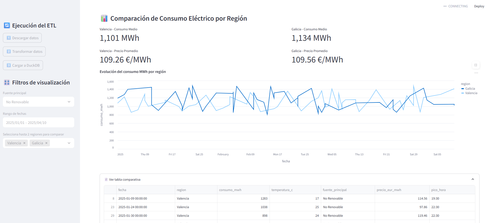

# ⚡ Proyecto ETL + Dashboard - Consumo Eléctrico

Este proyecto implementa un pipeline completo de Extracción, Transformación y Carga (ETL) de datos sobre el consumo eléctrico, junto con un dashboard interactivo desarrollado en Streamlit que permite visualizar comparaciones entre regiones, fuentes energéticas y fechas.

##🗂️ Descripción general

Este proyecto incluye un archivo ejecutable run_project.bat que permite lanzar el sistema completo de forma automatizada en Windows. Simula la descarga de datos desde una API (usando un archivo remoto de GitHub como endpoint), limpia y transforma los datos, los carga en DuckDB, y lanza el panel de visualización en Streamlit.

## 🎯 Objetivos
- Automatizar el flujo de trabajo ETL desde una interfaz web.
- Usar bases de datos embebidas (DuckDB) sin necesidad de servidores externos.
- Visualizar información energética con métricas y gráficos comparativos.
- Demostrar habilidades en Python, manejo de datos, SQL y desarrollo de dashboards.

---

## 🧱 Tecnologías utilizadas
| Herramienta   | Uso principal                         |
|--------------|---------------------------------------|
| **Python**   | Extracción, transformación y carga     |
| **Pandas**   | Limpieza y manipulación de datos       |
| **DuckDB**   | Base de datos embebida local           |
| **Streamlit**| Aplicación web y visualización interactiva |
| **Altair**   | Gráficos profesionales                 |

---

## 📁 Estructura del proyecto

consumo_energia_project/
│
├── data/
│ ├── raw/ # Datos originales descargados
│ ├── processed/ # Datos limpios y transformados
│ └── consumo.duckdb # Base de datos local
│
├── scripts/
│ ├── extract.py # Descarga datos desde una URL
│ ├── transform.py # Limpieza y validación de datos
│ ├── load_duckdb.py # Carga datos en DuckDB
│
├── dashboard/
│ └── dashboard.py # Dashboard completo en Streamlit
│
├── docs/
│ └── dashboard_example.png # Imagen del dashboard
│
├── requirements.txt # Dependencias Python
└── README.md # Documentación del proyecto

---

## 🔄 Flujo de trabajo (ETL)
1. **Extracción**: Descarga un CSV de consumo eléctrico desde una URL externa.
2. **Transformación**: Limpieza, normalización de nombres, conversión de tipos, eliminación de outliers.
3. **Carga**: Se carga el CSV limpio en una base de datos DuckDB para ser consultado vía SQL.

📷 Captura de pantalla (dashboard)

